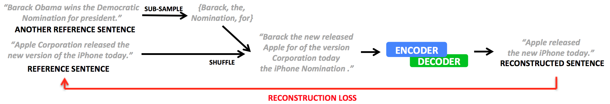

# Experiments in Unsupervised summarization

This is our [Pytorch](https://github.com/pytorch/pytorch) implementation of the summarization methods described in Unsupervised Sentence Compression using Denoising Autoencoders (CoNLL 2018). It features denoising additive auto-encoders with optional NLI hidden state initialization (based on [Infersent](https://github.com/facebookresearch/InferSent)).




Table of Contents
=================

  * [Requirements](#requirements)
  * [Quickstart](#quickstart)
  
## Requirements


```bash
pip install -r requirements.txt
```

## Quickstart

### Step 1: Get the data and create the vocabulary

Gigaword data can be downloaded from : https://github.com/harvardnlp/sent-summary. Then, extract it (```tar -xzf summary.tar.gz ```). Vocabulary can then be created by running ``` python src/datasets/preprocess.py train_data_file output_voc_file```)

### Step 2: Create an environment configuration file

This is used to locate the datasets, embeddings, whether you want to use gpu, etc. on your computer. You can see an example configuration at ```env_configs/env_config.json```. You only need to set nli variables if you use InferSent embeddings. 

Then setup the variable `NLU_ENV_CONFIG_PATH` to point to that file (e.g: `export NLU_ENV_CONFIG_PATH="env_configs/env_config.json"`). 

### Step 3: Train the model

Simply run:
```bash
python sample_scripts/dae_json.py runs/default/default.json
```

### Step 4: Run inference

```bash
python sample_scripts/simple_inference.py model_path test_data_path [output_data_path]
```

### Step 5: Evaluate ROUGE scores

To evaluate for rouge, we use [files2rouge](https://github.com/pltrdy/files2rouge), which itself uses
[pythonrouge](https://github.com/tagucci/pythonrouge).

Installation instructions:

```bash
pip install git+https://github.com/tagucci/pythonrouge.git
git clone https://github.com/pltrdy/files2rouge.git
cd files2rouge
python setup_rouge.py
python setup.py install
```

To run evaluation, simply run:
```bash
files2rouge summaries.txt references.txt
```

## FAQ

* **Random seed**: We did not use a random seed nor random restarts for the results in the paper
* **Teacher forcing**: We used teacher forcing in all of our experiments
* **Beam search**: We decoded using greedy decoding only, never using beam search
* **Added noise**: Is done on a sentence-per-sentence basis, not based on the max length in a batch. This is critical for performance